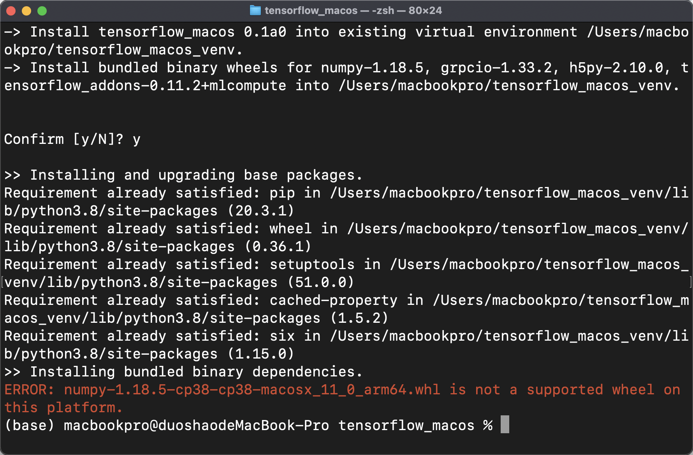
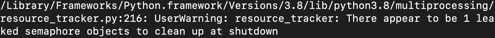
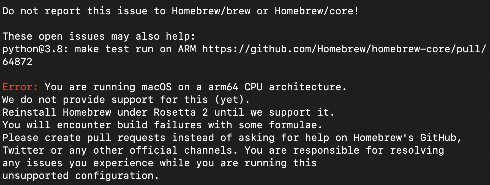

Apple Macbook pro M1 暂时无法使用的

1、针对机器学习的tensorflow 无法安装，用x86版本的无法调用CPU。

https://github.com/apple/tensorflow_macos
这个是Apple针对M1芯片开发的tensorflow，在执行 bash install_venv.sh 时候报错。

提示说是arm的包无法安装，Google之后，说是最好的解决办法是xcode重新安装一遍，放弃...

如果用x86的tensorflow提示如下..

看提示很大程度是因为cpu的问题。

只能等稳定版的TensorFlow出来。

2、后续

基本看明白了问题所在。
经过我测试，关键在于brew arm 版本安装不了python3.8 ，无法用arm python3.8 就无法安装arm 版本的tensorflow，如果用arch brew 安装的话，会自动安装x86版本，而x86版本你试试导入，还是无法导入TensorFlow....我去，至少我这边是这样，不知道为什么老外成功了。

